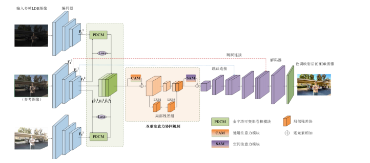
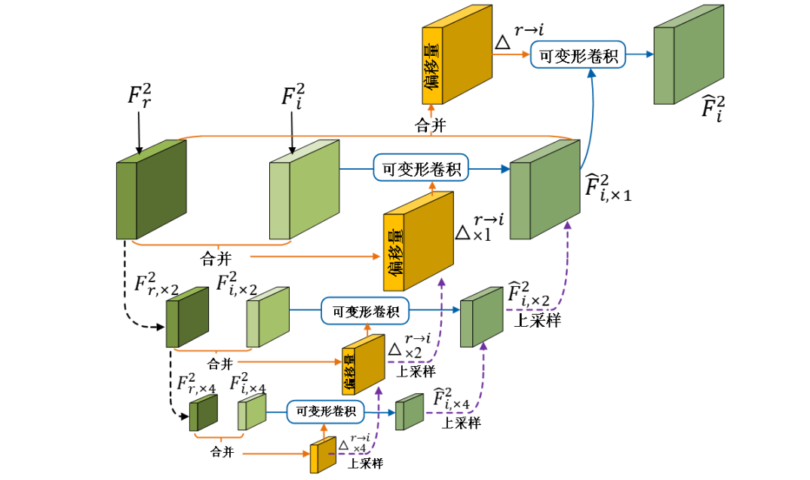
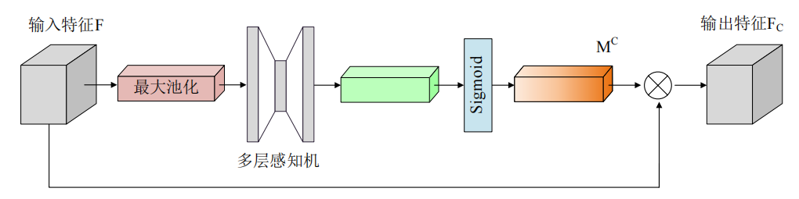
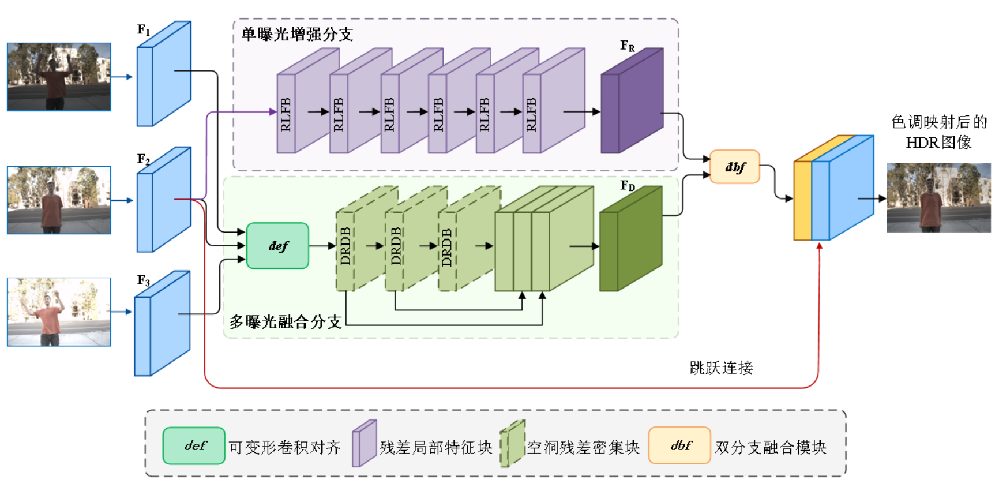
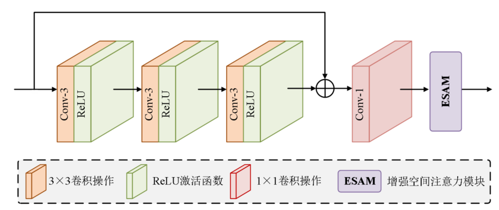
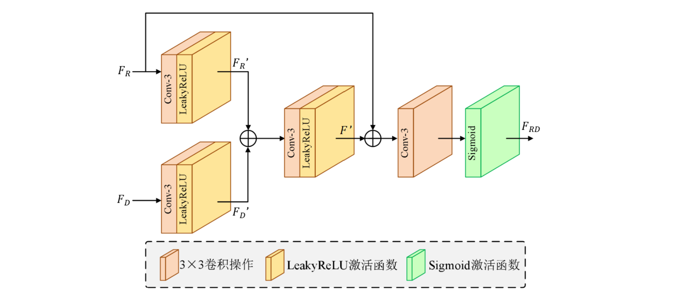
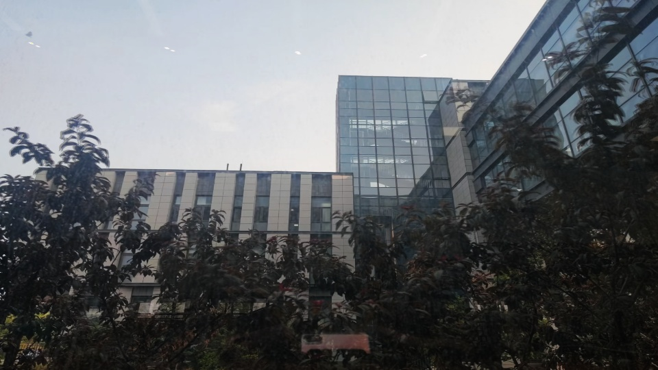
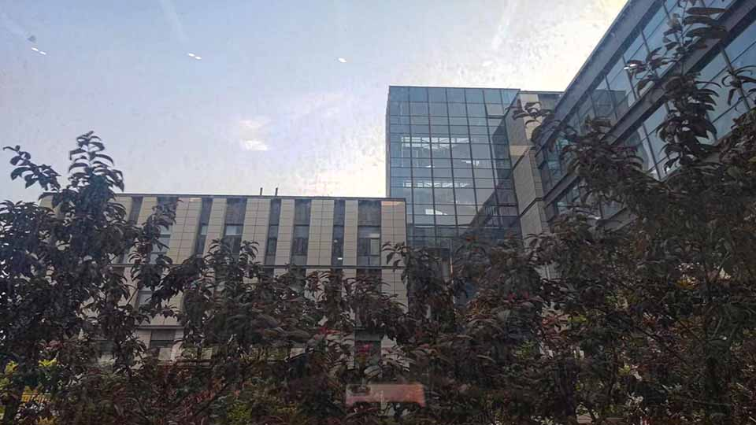

# High Dynamic Range Imaging

演示视频已发布，网址：https://www.bilibili.com/video/BV11KgzeBEQK/

## 一，研究背景

​	现如今，数字图像处理技术的不断发展，并且得到广泛应用，在我们常接触的领域，比如视频，游戏，电影，科研和教育等，几乎全都需要用到数字图像处理技术。相对于传统文字，一张图像可以携带的信息是十分巨大的，相对于一张排满文字的页面，我们会更喜欢简洁文字加图像的组合；由图像组合而成的视频，也是我们更乐意见到的，相对于繁琐的公式推导过程，我们会更喜欢一个短小精悍的视频阐述其中的变化过程；我们对于数字图像的质量要求也在不断提高。我们会希望图像越清晰越好，也许时间倒退十年，我们可以很习惯的观看一个清晰度为360P的视频，但现在我想应该很少会有人能容忍这个放在今天可以说十分模糊的图像了，可能现在我们对视频的清晰度最低要求都至少在720P。

​	传统的摄影技术和设备拍摄由于相机的感光元件和显示器的动态范围限制，所拍摄的图像属于低动态范围（Low Dynamic Range，LDR）图像。LDR 图像是一种灰度级范围有限的图像，通常采用 8 位色深表示[1]，只能表现出有限的亮度范围。当亮度范围超出摄像机或显示器的能力时，LDR 图像的亮度会被截断或压缩，导致亮部或暗部的细节丢失。此外，LDR 图像的色彩信息相对较少，难以表现出真实的场景颜色和纹理。

​	高动态范围（High Dynamic Range，HDR）图像的亮度范围可以达到 LDR 图像的几千到几百万倍，通常采用 16 位或 32 位色深表示，能够捕捉到更广泛的亮度范围和更丰富的细节和颜色信息。所以HDR将会比LDR图像有着更好的质量与观感。我们都清楚苹果手机的拍照功能是十分强大的，它拍出来的图片总是给我们一种画质更好更加真实的感觉，实际上也是因为苹果手机有着HDR拍照功能。

​	然而，由于 HDR 图像的采集和处理需要更高的计算和存储能力，因此对硬件和算法的要求也更高，获取高质量的 HDR 图像成为了一个具有挑战性的问题。想要解决这个问题，我们首先要理解HDR相关的理论基础。

## 二，相关理论基础

### 1.数码相机成像基础

​	总的来说，数码相机成像是一个将光学信号转化为数字信号的过程，可以分为这几个步骤：

①将外界光线聚焦到图像传感器上，通过图像传感器将光信号转变成电信号，再通过数字信号处理芯片对图像进行处理
②将通过光学系统聚焦在传感器上的光线转化为电信号
③图像感应器输出的信号是模拟信号，需要通过模数转换器将其转化成数字信号，以便于数字信号处理器进一步处理和存储
④对图像信号进行处理和优化过程包括以下几个主要步骤：色彩校正、白平衡、锐化、去噪、色调映射、色彩增强等
⑤最后，处理后的数字图像存储在相机的存储介质中

### 2.动态范围（Dynamic Range）

​	图像的动态范围是图像中最亮的区域和最暗的区域之间所涵盖的亮度范围，即在 ISO 感光度、快门速度和光圈大小不变的情况下，最暗和最亮部分之间所需要的曝光差异。动态范围越大，表示相机可以在较暗或较亮的场景中保留更多的细节信息，同时也意味着相机有更高的曝光容忍度和更强的抗过曝光和欠曝光能力。在数码图像中，动态范围通常以比特深度（Bit Depth）或色彩深度（Color Depth）来表示，即每个像素用多少位来存储亮度信息。比特深度越高，每个像素可以表示的亮度级别就越多，动态范围也就越大。设比特深度为 N，那么一个像素可以表示的亮度级别就是 2的N次方。在 8 比特深度的图像中，每个像素可以表示 256 个亮度别，而 16 比特深度的图像中，每个像素可以表示 65536 个亮度级别，动态范围更大。

​	数码相机在捕捉现实场景时存在着一个普遍的问题，那就是场景亮度范围非常广泛，从非常暗淡的光线（约10的负6次方cd/m²）到极强的光照（约10的负9次方cd/m²）不等。由于常规数码相机的动态范围有限，难以同时捕捉到不同亮度区域的信息，导致捕捉到的图像与人眼所感知到的真实场景存在着巨大的差异。如果相机设置不当或场景中存在过强的光源，就可能导致图像出现过度曝光现象，即高亮区域细节丢失，呈现出一片白色；反之，如果场景中存在过于昏暗的区域，就会导致图像欠曝光，即暗部细节丢失，呈现出一片黑色。这些问题导致相机无法准确地捕捉到真实场景中的细节信息，限制了图像的应用和展示效果。为了弥补这一缺陷，高动态范围技术应运而生，它通过多种方法和技术手段，扩展了相机所能够捕捉到的动态范围，使其在拍摄高亮度和低亮度区域的同时，也能保留场景的丰富细节信息，从而更好地还原真实的场景。

### 3.HDR编码格式

​	HDR图像编码格式用于将高动态范围的图像信息压缩到合理的大小以便存储和传输。目前常见的编码格式主要有三种，分别是Randice HDR，OpenEXR以及TIFF，主要介绍一下TIFF：

​	TIFF 是一种通用的图像文件格式，可以保存灰度图像、彩色图像以及 HDR 图像，后缀名为.tif。在 HDR 图像方面，TIFF 格式通常使用 16 位或 32 位浮点数来表示亮度值，支持各种压缩算法和色彩空间，并且可以存储多个分辨率和通道的信息。

​	此外，我们所熟悉的png格式其实也是支持HDR图像的编码和存储。不过并没有一种编码方式能成为其他编码格式的绝对上位替代，它们都有适合它们自身的应用场景。

### 4.色调映射

​	在 HDR 重建过程中，色调映射（Tone Mapping）是将高动态范围图像的色调映射到低动态范围设备上的过程。由于计算机显示器和打印机等低动态范围设备的动态范围很有限，只能够显示有限的亮度和颜色变化。而 HDR 图像则可以拥有更高的色深和动态范围，甚至可以显示数千万种颜色值的级别。因此，为了在这些低动态范围设备上显示 HDR 图像，需要通过一定的算法将 HDR 图像的高动态范围信息压缩到可处理范围内，以便更好地呈现 HDR 图像。色调映射算法的目标是将 HDR 图像中的亮度信息映射到 LDR 范围内的亮度值，并且保持图像的整体对比度和细节信息，同时还要尽可能地使得色调变化自然平滑，避免出现明显的色调突变。

​	线性 Tone Mapping 算法是我们最熟悉同时也是最简单的色调映射算法，其基本思想是将 HDR图像中每个像素的 RGB 值乘以一个比例因子，线性映射的公式如下：

 		𝐼𝐿𝐷𝑅(𝑥,𝑦) =𝐼𝐻𝐷𝑅(𝑥,𝑦)/𝐿𝑚𝑎𝑥
其中，𝐼𝐻𝐷𝑅(𝑥,𝑦)是 HDR 图像中像素(𝑥, 𝑦)的 RGB 值，𝐼𝐿𝐷𝑅(𝑥,𝑦)是 LDR 图像中像素(𝑥, 𝑦)的 RGB 值，𝐿𝑚𝑎𝑥是 HDR 图像中最大的亮度值。该方法的优点是简单易懂，但由于它的线性特性，不足以充分利用 HDR 图像的高动态范围信息。

## 三，实验目标

我们的目标是完成基于金字塔可变形卷积的多曝光 HDR 重建算法和双分支网络引导的HDR图像重建算法两种算法的无代码论文复现，并最终比较两个方法获得的图像效果。

## 四，相关工作

​        高动态范围（HDR）成像技术旨在表示真实场景中发现的广泛的亮度水平，从直射阳光到阴影。传统的成像方法由于摄像机和显示设备的动态范围有限，常常无法捕捉或显示自然场景中的全范围亮度。HDR技术通常涉及捕捉同一场景的多次曝光并将它们合并为一个具有更大动态范围的图像。是一个随着时间推移在捕捉、存储和显示具有比标准数字成像技术更高动态范围的亮度图像的需求推动下取得了显著进展的领域。

​		目前HDR成像重要包括以下方法：

1.曝光包围和图像融合

​		创建HDR图像的最常见方法是捕捉不同曝光水平的多张图像并将它们合并为一张HDR图像。比如Debevec和Malik提出的辐射图构建技术，该技术利用摄像机响应函数将不同曝光设置下捕获的图像进行组合。这种方法虽然有效，但通常需要静态场景以避免由于运动引起的鬼影伪影。

2.单张图像HDR

​         为了解决多曝光方法的限制，单张图像HDR方法应运而生。这些方法利用机器学习和卷积神经网络（CNN）来预测单次曝光的HDR内容。Eilertsen等人和Kalantari等人的工作在从单个低动态范围（LDR）输入生成HDR图像方面显示出令人鼓舞的结果。

3.深度学习HDR成像
        深度学习的最新进展彻底改变了HDR成像。CNN和生成对抗网络（GAN）用于增强HDR重建。Chen等人通过一个深度网络进行HDR成像，通过学习LDR到HDR的映射来显著减少伪影并提高动态场景中HDR成像的鲁棒性。

4.HDR视频

​        将HDR成像扩展到视频需要解决时间一致性和增加的计算负荷。Kalantari等人使用光流在时间上对齐帧并将其合并为HDR视频序列。深度学习方法也在探索以提高效率和质量。

​		目前，HDR图像领域的研究重点是提高HDR图像质量、处理动态场景和降低计算复杂性。张等人提出的使用金字塔结构和可变形卷积的方法改进了不同曝光图像的对齐和融合，从而提高了HDR质量。此外，注意力机制如空间和通道注意力被集成到HDR框架中，以更好地处理各种照明条件和复杂场景。

​		尽管取得了显著进展，但HDR成像仍然存在一些挑战：

1. 动态场景
           处理不同曝光之间的运动仍然是一个关键问题。虽然光流和可变形卷积等技术有所帮助，但在高度动态的场景中它们并不完美，可能会引入伪影。

2. 计算复杂性
          HDR成像特别是深度学习方法可能计算量很大。实时HDR视频处理由于其高计算需求仍然是一项挑战。

3. 显示和存储
           在标准动态范围（SDR）显示器上高效显示HDR内容而不显著损失细节仍然是一个持续的挑战。同样，高效存储HDR内容同时保持其质量也是一个活跃的研究课题。

4. 色彩保真度
           确保HDR图像中的颜色再现准确是另一个未解决的问题。HDR成像有时会导致不自然的颜色，并且在各种设备上保持颜色保真度具有挑战性。

## 五，实验过程

### 1.1 数据集

​		在本实验中，我们使用的数据集为Kalantari发布的数据集，该数据集中的场景包括室内和室外、不同光照条件、不同的物体、颜色和纹理等，分为 74 个训练序列和 10个测试序列。每个多曝光序列由 3 张曝光值不同的 LDR 图像和一张与中间曝光 LDR 图像相对应的高质量 HDR 图像组成，这些多曝光序列中 LDR 图像曝光有{−3、0、+3}或{−2、0、+2}两种情况，每个序列中各图像对应的曝光值都存储在文件 expore.txt 中供查看。此外，这些图像的为了防止网络过度依赖某些特定的局部结构，本文将 1000×1500 的原始图像进行了随机裁剪，裁剪后的图像尺寸为 256×256。此外，还对图像进行了随机翻转和随机旋转以增加数据的多样性，使得网络更好地学习到图像中的共性特征。对图像进行随机裁剪、随机反转和随机旋转的代码如下：

```
transform = transforms.Compose([
    transforms.RandomCrop((256, 256)),
    transforms.RandomHorizontalFlip(),
    transforms.RandomVerticalFlip(),
    transforms.ToTensor()
])
```

### 1.2 基于金字塔可变形卷积的多曝光 HDR 重建算法

#### 1.2.1 网络整体结构




​	    网络首先将三张不同曝光值的LDR图像输入编码器中提取N个不同尺度的图像特征，接着将这些特征输入对应的金字塔可变形卷积模块 PDCM 中进行由粗到细的对齐。再将对齐结果输入双注意力协同机制 DASM中，通过通道注意力模块、局部残差组和空间注意力模块协同工作，自适应地对特征进行筛选和聚焦。本章还设计了联合损失函数进一步避免重建的 HDR 图像中出现运动伪影。最后，通过解码器层的反卷积操作输出最终的重建 HDR 结果。

#### 1.2.2 编码器与解码器

​		编码器参考U-Net编码器结构，编码器包含三个简单的卷积块结构，由两个卷积层和ReLU激活函数组成。最后使用了一个最大池化层降低特征图的空间尺寸。输入图像的尺寸为 256×256×3，经过第一层特征提取后特征的尺寸为H/2×W/2×64，第二层特征的尺寸为 H/4×W/4×128，第三层的特征的尺寸为H/8×W/8×256，每层特征的维度是上一层的 1/2，通道数的上一层的 2 倍。

```
class UNetEncoder(nn.Module):
    def __init__(self):
        super(UNetEncoder, self).__init__()
        self.enc1 = self.conv_block(3, 64)
        self.enc2 = self.conv_block(64, 128)
        self.enc3 = self.conv_block(128, 256)
        self.pool = nn.MaxPool2d(kernel_size=2, stride=2)

    def conv_block(self, in_channels, out_channels):
        return nn.Sequential(
            nn.Conv2d(in_channels, out_channels, kernel_size=3, padding=1),
            nn.ReLU(inplace=True),
            nn.Conv2d(out_channels, out_channels, kernel_size=3, padding=1),
            nn.ReLU(inplace=True)
        )

    def forward(self, x):
        f0 = self.enc1(x)  # H x W x 64
        f1 = self.pool(f0)  # H/2 x W/2 x 64
        f1 = self.enc2(f1)  # H/2 x W/2 x 128
        f2 = self.pool(f1)  # H/4 x W/4 x 128
        f2 = self.enc3(f2)  # H/4 x W/4 x 256
        return [f0, f1, f2]
```

​		解码器则用于反卷积操作输出最终的重建HDR结果。

```
# UNet Decoder
class UNetDecoder(nn.Module):
    def __init__(self):
        super(UNetDecoder, self).__init__()
        self.upconv1 = self.upconv_block(256, 128)
        self.upconv2 = self.upconv_block(128, 64)
        self.upconv3 = nn.ConvTranspose2d(64, 3, kernel_size=2, stride=2)

    def upconv_block(self, in_channels, out_channels):
        return nn.Sequential(
            nn.ConvTranspose2d(in_channels, out_channels, kernel_size=2, stride=2),
            nn.ReLU(inplace=True),
            nn.Conv2d(out_channels, out_channels, kernel_size=3, padding=1),
            nn.ReLU(inplace=True)
        )

    def forward(self, x):
        x = self.upconv1(x)  # H/4 x W/4 x 128
        x = self.upconv2(x)  # H/2 x W/2 x 64
        x = torch.sigmoid(self.upconv3(x))  # H x W x 3
        return x
```

#### 1.2.3 金字塔可变形卷积模块

​        分别将上下相邻的非参考图像特征与参考图像特征输入金字塔可变形卷积模块进行对齐处理，获得向参考图像对齐后的特征，该过程可以用数学公式表示如下：
$$
F_{1p}^2=f_{PDCM}(F_1^2,F_2^2)
$$

$$
F_{3p}^2=f_{PDCM}(F_3^2,F_2^2)
$$

​		金字塔可变形卷积模块是将可变形卷积模块加入金字塔结构形成的该模块相较于常规卷积模块，增加了可变形的偏置参数，可以改变卷积核的形状和大小，从而适应不同的运动状态，提高图像的对齐效果，有效减少运动伪影的产生。



​        首先采用金字塔结构来提取多层次的特征表示，使用卷积进行下采样获得输入特征 1/2 维度的和 1/4 维度的特征。接着，在不同尺度下利用可变形卷积合成参考特征与非参考特征的相关信息。将金字塔最下层特征进行通道维度的合并输入一个卷积核为 3 的卷积层中，获得特征间的偏移量△然后利用该偏移量对最下层非参考特征通过可变形卷积函数𝒟(∙)完成对齐过程，得到金字塔最下层的对齐特征，同样地，通过金字塔中间层特征获得中间层特征的偏移量将最下层特征的偏移量输入步长为 2 的卷积层进行上采样得到新的偏移量输入给中间层，得到最终中间层特征的偏移量。然后将中间层非参考特征与偏移量输入可变形卷积函数𝒟(∙)得到金字塔中间层的对齐特征。接下来，对输入的金字塔最上层特征提取偏移量，同样地将中间层特征的偏移量上采样得到新的对应偏移量，通过前两个偏移量得到该尺度的最新偏移量与中间层操作类似，将输入的非参考特征与偏移量输入可变形卷积得到最上层的对齐特征。最后，为了进一步充分学习参考图像的图像结构和目标形态，将参考图像特征与经过金字塔各尺度对齐后的特征进行可变形卷积对齐，同样的操作先经过卷积获得对应的偏移量，最终获得金字塔可变形卷积对齐后的特征。

```
class PDCM(nn.Module):
    def __init__(self, in_channels, out_channels):
        super(PDCM, self).__init__()
        self.offset_conv1 = nn.Conv2d(in_channels * 2, 18, kernel_size=3, stride=1, padding=1)
        self.deform_conv1 = DeformConv2d(in_channels, out_channels, kernel_size=3, stride=1, padding=1)
        
        self.offset_conv2 = nn.Conv2d(out_channels * 2, 18, kernel_size=3, stride=1, padding=1)
        self.deform_conv2 = DeformConv2d(out_channels, out_channels, kernel_size=3, stride=1, padding=1)
        
        self.offset_conv3 = nn.Conv2d(out_channels * 2, 18, kernel_size=3, stride=1, padding=1)
        self.deform_conv3 = DeformConv2d(out_channels, out_channels, kernel_size=3, stride=1, padding=1)

    def forward(self, ref, nbr):
        offset1 = self.offset_conv1(torch.cat([ref, nbr], dim=1))
        deform1 = self.deform_conv1(nbr, offset1)
        
        offset2 = self.offset_conv2(torch.cat([ref, deform1], dim=1))
        deform2 = self.deform_conv2(deform1, offset2)
        
        offset3 = self.offset_conv3(torch.cat([ref, deform2], dim=1))
        deform3 = self.deform_conv3(deform2, offset3)
        
        return deform3
```

#### 1.2.4 双重注意力协同机制

​		双重注意力协同机制由通道注意力模块（Channel Attention Module，CAM）、局部残差组（Local Residual Group，LRG）和空间注意力模块（Spatial Attention Module，SAM）三个部分组成。



​        CAM模块输入大小为H×W×C的特征F，首先通过一个全局最大池化层，生成一个大小为1×1×C 的全局特征向量𝑋，接着将向量X输入两个全连接层组成的多层感知机得到各通道的加权系数。然后，使用Sigmoid 激活函数对多层感知机输出的加权系数进行归一化处理。最后，将学习到的加权系数与输入特征 F 逐元素相乘，得到新特征 。

```
class CAM(nn.Module):
    def __init__(self, in_channels):
        super(CAM, self).__init__()
        self.gap = nn.AdaptiveAvgPool2d(1)
        self.mlp = nn.Sequential(
            nn.Linear(in_channels, in_channels // 16),
            nn.ReLU(),
            nn.Linear(in_channels // 16, in_channels),
            nn.Sigmoid()
        )

    def forward(self, x):
        b, c, _, _ = x.size()
        y = self.gap(x).view(b, c)
        y = self.mlp(y).view(b, c, 1, 1)
        return x * y.expand_as(x)

```

​		将新特征输入局部残差组LRG。LRG是由九个相同类型的局部残差块LRB依次堆叠而成的一种组合形式。每个 LRB 包含两个卷积核大小为 3×3 的常规卷积层、ReLU 激活函数和归一化层。每次卷积操作之前先经过 ReLU 激活函数进行处理，但只有第一次卷积操作后需要归一化层进行处理。残差连接则是将输入和第二个卷积操作的输出相加。 通过多个局部残差块的堆叠获得最后一个残差块的结果，然后通过残差连接将局部残差组的输入与堆叠局部残差块的输出相乘，得到局部残差组的输出特征。

```
# LRB
class LRB(nn.Module):
    def __init__(self, in_channels):
        super(LRB, self).__init__()
        self.conv1 = nn.Conv2d(in_channels, in_channels, kernel_size=3, padding=1)
        self.bn = nn.BatchNorm2d(in_channels)
        self.conv2 = nn.Conv2d(in_channels, in_channels, kernel_size=3, padding=1)
        self.relu = nn.ReLU()

    def forward(self, x):
        out = self.relu(self.conv1(x))
        out = self.bn(out)
        out = self.conv2(out)
        return x + out

# LRG
class LRG(nn.Module):
    def __init__(self, in_channels, num_blocks=9):
        super(LRG, self).__init__()
        self.blocks = nn.Sequential(*[LRB(in_channels) for _ in range(num_blocks)])

    def forward(self, x):
        return self.blocks(x) + x
```

​        将输出特征出入SAM模块，首先分别对特征进行全局平均池化和全局最大池化然后，这两种池化结果进行聚合后输入到 1×1 的卷积层中进行计算，生成新的特征映射；利用 Sigmoid 激活函数对像素特征矩阵进行激活，得到像素之间的加权矩阵。将加权矩阵与输入特征张量进行矩阵乘法计算，获得空间注意力增强后的输出特征。

```
class SAM(nn.Module):
    def __init__(self, in_channels):
        super(SAM, self).__init__()
        self.conv = nn.Conv2d(in_channels, 1, kernel_size=1)
        self.sigmoid = nn.Sigmoid()
        self.avg_pool = nn.AdaptiveAvgPool2d(1)
        self.max_pool = nn.AdaptiveMaxPool2d(1)

    def forward(self, x):
        avg_out = self.avg_pool(x)
        max_out = self.max_pool(x)
        y = self.conv(avg_out + max_out)
        y = self.sigmoid(y)
        return x * y
```

​		将该特征输入解码器可得到生成的HDR图像。

#### 1.2.5 损失函数

​		在实验中我们使用了联合损失函数。𝐿1损失函数来计算重建图像和真实图像之间的绝对差异的平均值，以获得更高质量的重建效果。𝐿1损失函数可表示为如下公式：
$$
L_{net}=\frac 1N \sum_{i=1}^n||H-H_1||_1
$$
​        H1表示该网络最终重建出的 HDR 图像，*H* 表示对应的真实像。

​	    用𝐿2损失函数来计算金字塔可变形卷积模块对齐后图像和参考图像之间的平方差异的平均值。𝐿2损失函数可表示为如下公式：
$$
L_{1to2}=\frac 1N \sum_{i=1}^n||F_{1p}^2-F_{2}^2||_2^2
$$

$$
L_{3to2}=\frac 1N \sum_{i=1}^n||F_{3p}^2-F_{2}^2||_2^2
$$

​		总损失函数可表示为：
$$
L=L_{net}+L_{1to2}+L_{3to2}
$$

### 1.3 双分支网络引导的HDR图像重建算法

​		在实际的多张图像重建HDR的应用中，往往由于曝光值的不同和图像对其的误差等等原因，可能会导致图像出现重叠、偏移，颜色失真或者出现斑点。同时，LDR图像中的过曝光或欠曝光也会导致颜色伪影：当曝光时间过长，会导致亮度过高，区域呈现明显的白色或亮黄色，重建的HDR图像也会失真，高光区域颜色出现偏移；当曝光时间过短，会使得区域内某些地方亮度过低，呈现出黑色或灰色，丢失暗处内容，此时重建的HDR图像就会显得饱和度不高，暗处缺乏细节。针对这些问题，我们使用双分支网络引导的HDR图像重建算法。

#### 1.3.1 网络整体结构

​		双分支网络引导的HDR图像算法通过平衡参考特征和相邻特征，使得最终图像效果更好，更大可能的避免出现重影叠影。算法由两大部分组成，分别是多个不同曝光值的LDR图像的融合部分，和使用单个参考图像增强结果的参考分支。多曝光分支中融合了一个经过学习的卷积模块，使得图像的过曝光和欠曝光区域影响更小，然后借助空洞密集残差块恢复被影响的部分；单曝光分支通过堆叠的残差局部特征块，将参考图像中的细节和颜色保留；最后通过双分支融合的方式讲两个分支的结果合成出最终的HDR图像。



#### 1.3.2 多曝光融合分支

​		多曝光融合分支的完成参考上一部分中的可变形卷积，设接收到的不同曝光值的图像为F~1~,F~2~,F~3~，为了减少HDR重建的时间，同时减少模型参数量，利用可变形对齐模块对多曝光HDR重建任务进行初步对齐。具体步骤：

- 以参考图像为基准，将F~1~与F~3~对齐，获得对齐后的新F~1~与F~3~；

- 将新的F~1~与F~3~与参考图像F~2~堆叠后输入卷积层,获取最终综合特征F
  $$
  F=Conv(Concat(F_1,F_2,F_3))
  $$

- 将对齐后的特征F依次输入空洞密集残差块（DRDB）的映射函数，令每个空洞的输入对应上个空洞密集残差块的输出，形如：
  $$
  F_D^1=f_D^1(F)\\
  F_D^2=f_D^2(F_D^1)\\
  F_D^3=f_D^3(F_D^2)\\
  $$
  
- 将三个空洞密集残差块的融合特征综合为融合分支的最终特征 F~D~
  $$
  F_D=f_{merge}(F^1_DF^2_DF^3_D)
  $$

```
class DeformableConvModule(nn.Module):
    def __init__(self, in_channels, out_channels):
        super(DeformableConvModule, self).__init__()
        self.offset_conv = nn.Conv2d(in_channels, 2 * in_channels, kernel_size=3, padding=1)
        self.deform_conv = nn.Conv2d(in_channels, out_channels, kernel_size=3, padding=1)

    def forward(self, x):
        offset = self.offset_conv(x)
        out = F.grid_sample(x, offset)
        out = self.deform_conv(out)
        return out
       
class DRDB(nn.Module):
    def __init__(self, in_channels, growth_rate=32, num_layers=6):
        super(DRDB, self).__init__()
        layers = []
        for i in range(num_layers):
            layers.append(nn.Conv2d(in_channels + i * growth_rate, growth_rate, kernel_size=3, padding=1, dilation=2))
        self.layers = nn.ModuleList(layers)

    def forward(self, x):
        features = [x]
        for layer in self.layers:
            out = F.relu(layer(torch.cat(features, 1)))
            features.append(out)
        return torch.cat(features, 1)
```


#### 1.3.3 单曝光增强分支

​		单曝光增强分支只需要参考图像特征F~2~，使F~2~依次通过多个堆叠的残差局部特征块（RLFB），保持模型轻量的同时增强图像的细节特征和视觉效果。



​		残差局部特征块通过局部特征增强来提取和增强参考图像中的细节和颜色信息，具体包括残差链接、卷积层、激活函数等，用以提升特征表达能力。通过残差连接可以使网络更深，同时避免梯度消失的问题，从而更好捕捉图像的细节特征，使最终图像呈现效果更好。在单曝光增强分支中，通过连接多个RLFB模块，将每个模块提取的参考图像的细节特征存储，融合，最后输出增强后的特征F~R~。

```
class RLFB(nn.Module):
    def __init__(self, in_channels, num_blocks=3):
        super(RLFB, self).__init__()
        layers = []
        for _ in range(num_blocks):
            layers.append(nn.Conv2d(in_channels, in_channels, kernel_size=3, padding=1))
            layers.append(nn.ReLU(inplace=True))
        self.layers = nn.Sequential(*layers)

    def forward(self, x):
        return self.layers(x) + x
```

​		残差局部特征块的另一部分是增强空间注意力模块，在前面的残差网络输出结果后将结果F~R~导入到增强注意力模块中，这个模块会学习不同位置的重要性，最终强化图像的局部特征。具体来说，它会首先降低特征图的通道数，然后利用跨步卷积计算和最大池化层的结合扩大图像深度，最后恢复原来的维度。

#### 1.3.4 双分支融合模块

​		双分支融合模块主要的目的是融合单曝光增强分支和多曝光融合分支点特征，综合两者的优势，从而增强最终图像的细节。



​		首先，融合模块对各分支的输出进行特征提取，获得F~R~,F~D~；随后对获得的特征在通道维度上直接进行叠加，将叠加后的特征输入特征提取函数以恢复通道维度；最后将获取的融合特征与单分支增强分支的输出再进行一次残差连接，以增强单分支的效果，最终输出双分支融合结果F~RD~。

```
class DualBranchHDRNet(nn.Module):
    def __init__(self, num_channels=64):
        super(DualBranchHDRNet, self).__init__()
        self.deformable_conv = DeformableConvModule(num_channels, num_channels)
        self.drdb = DRDB(num_channels)
        self.rlfb = RLFB(num_channels)
        self.fusion_conv = nn.Conv2d(num_channels * 2, num_channels, kernel_size=3, padding=1)
        self.reconstruct_conv = nn.Conv2d(num_channels, 3, kernel_size=3, padding=1)

    def forward(self, ldr_images, ref_image):
        aligned_features = self.deformable_conv(ldr_images)
        fused_features = self.drdb(aligned_features)
        ref_features = self.rlfb(ref_image)
        combined_features = torch.cat([fused_features, ref_features], dim=1)
        fusion_features = self.fusion_conv(combined_features)
        hdr_image = self.reconstruct_conv(fusion_features)

        return hdr_image
```

#### 1.4 性能评估

​		实验使用峰值信噪比（Peak Signal-to-Noise Ratio，PSNR）、结构相似度指数度量（Structural Similarity Index，SSIM）和 HDR 视觉差异预测器（High Dynamic Range Visual Difference Predictor，HDR-VDP-2）作为评估的指标。首先计算了线性空间的 PSNR 和 SSIM，即 PSNR-L 和 SSIM-L。由于在 HDR 图像处理中，经常会将图像数据存储为浮点数，而这些数值不一定是线性的。所以我们还使用 µ-law 算法对重建图像进行了色调映射，然后计算了 PSNR-µ 和SSIM-μ 指标来评估重建质量。

#### 1.5 实验结果

测试用的照片是在学校内拍摄的信息学部图片，三张照片曝光时间分别为1/500、1/200、1/80，分别包含了亮处天空的细节与暗处草丛的细节，可以更好的展示算法结果。三张照片在text文件夹中，在此不做展示。

基于金字塔可变形卷积的多曝光 HDR 重建算法：



双分支网络引导的HDR图像重建算法：




## 六，实验总结和讨论

​         基于金字塔可变形卷积的多曝光 HDR 重建算法讨论了由于各图像间的运动差异，导致重建结果存在运动伪影的问题，提出一个金字塔可变形卷积引导双注意力协同融合 HDR 重建网络。利用金字塔结构从粗到细地使用可变形卷积进行特征层的对齐，并利用由通道注意力模块、局部残差组和空间注意力模块组成的双注意力协同机制优化重建效果。其中，经过通道注意力模块筛选后的特征被输入到局部残差组进行融合，然后通过空间注意力模块进一步增强模型对于输入图像不同空间区域的关注程度，提高模型在空间感知能力上的表现细节；最后通过联合损失函数提高网络的泛化性。通过这个算法，给我印象最深的首先是可变形卷积的使用以及联合损失函数。传统的卷积操作是在固定的规则网格上进行的，而可变形卷积可以根据输入数据的特征动态地调整卷积核的采样位置。这使得可变形卷积能够更灵活地适应不规则的特征分布，这使得它有提高感受野的非均匀采样能力、减少运动伪影、提高对其精度等好处。此外，本实验使用联合损失函数来更好地反映重建结果的质量，这也将让我在以后完成复杂任务时考虑联合损失函数。

​		在双分支网络部分，目标是利用双分支多出的单曝光增强分支的优势，使得最终图像没有色彩模糊、图像细节留存更高等优点，为了实现这个效果需要分别处理多曝光融合分支、单曝光增强分支和双分支融合部分，最终多次循环训练。其中，多曝光主要使用可变形卷积对其图像，然后对特征图进行堆叠与卷积，以得到每个特征图对应的特征向量，而单曝光则是只使用一张参考图像，使其依次通过六个堆叠的残差局部特征块，每个特征块又都是由一个残差网络与一个增强空间注意力模块组成，保持轻量化的同时确保最终效果，最后融合时将两个部分输出的特征叠加，在恢复通道维度后再与单通道的结果进行残差连接，最后获得融合特征。

​		由于算力有限，最终我们采用了更小的训练集，训练出的参数所生成的HDR图像精度并不高，不过依旧能够对两个算法进行比较。对于基于金字塔可变形卷积的HDR，训练结果并不能很好提现其对于运动伪影的处理结果，但整体图像采样更加优秀，最终重建结果的质量更好；对于双分支网络，由于加入了参考图像特征，单个特征的权重被放大，运动伪影更少，但多曝光的参数被忽视，图像整体看起来噪点很多，并不优秀。

## 七，分工与参考文献


### 分工情况：

梁方明：提供理论基础支持，实现数据集导入，DeBug。

李诗钰：提供数据集，实现基于金字塔可变形卷积的多曝光 HDR。

马可：视频讲解录制，实现双分支网络引导的HDR图像重建算法。

三人均参与了寻找参考文献与代码，以及实验报告的撰写。

### 贡献率：

每个人33.3%的贡献率。

### 参考文献：

1. Debevec, P. E., & Malik, J. (1997). Recovering high dynamic range radiance maps fromhotographs. Proceedings of the 24th annual conference on Computer graphics and interactive techniques.

2. Eilertsen, G., Kronander, J., Denes, G., Mantiuk, R. K., & Unger, J. (2017). HDR image reconstruction from a single exposure using deep CNNs. ACM Transactions on Graphics (TOG), 36(6), 178.

3. Kalantari, N. K., Ramamoorthi, R. (2017). Deep high dynamic range imaging of dynamic scenes. ACM Transactions on Graphics (TOG), 36(4), 144.

4. Chen, C., Golub, G. H., & Plemmons, R. J. (2016). Deep HDR imaging via a non-local network. IEEE Conference on Computer Vision and Pattern Recognition (CVPR), 1715-1724.

5. Kalantari, N. K., Wang, T. C., & Ramamoorthi, R. (2019). Learning-based view synthesis for HDR images. IEEE Transactions on Visualization and Computer Graphics, 25(11), 3081-3092.

6. Zhang, F., Zhang, X., Zhong, Y., & Hu, S. (2020). Attention-guided network for ghost-free high dynamic range imaging. IEEE Transactions on Multimedia, 22(7), 1708-1721.

7. [1]庞子微.(2023).基于深度学习的多曝光HDR图像重建算法研究硕士(学位论文,北京交通大学).硕士https://link.cnki.net/doi/10.26944/d.cnki.gbfju.2023.002959doi:10.26944/d.cnki.gbfju.2023.002959.

8. Ronneberger O, Fischer P, Brox T. U-net: Convolutional networks for biomedical image 

   segmentation[C]. In Proceedings of Medical Image Computing and Computer-Assisted 

   Intervention, 2015: 234-241.

9. Dai J, Qi H, Xiong Y, et al. Deformable convolutional networks[C]. In Proceedings of the 

   IEEE/CVF International Conference on Computer Vision, 2017: 764-773.

   

   
